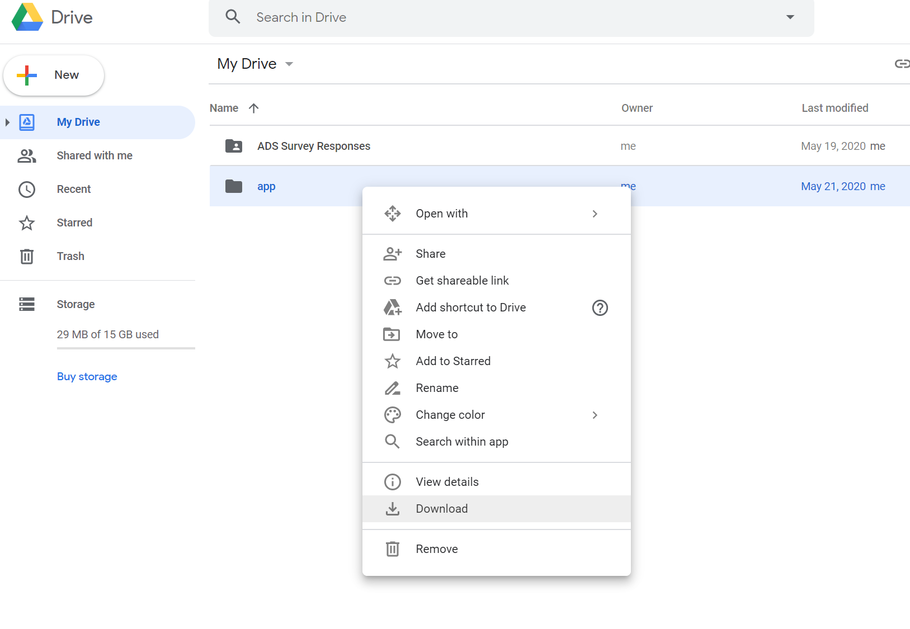
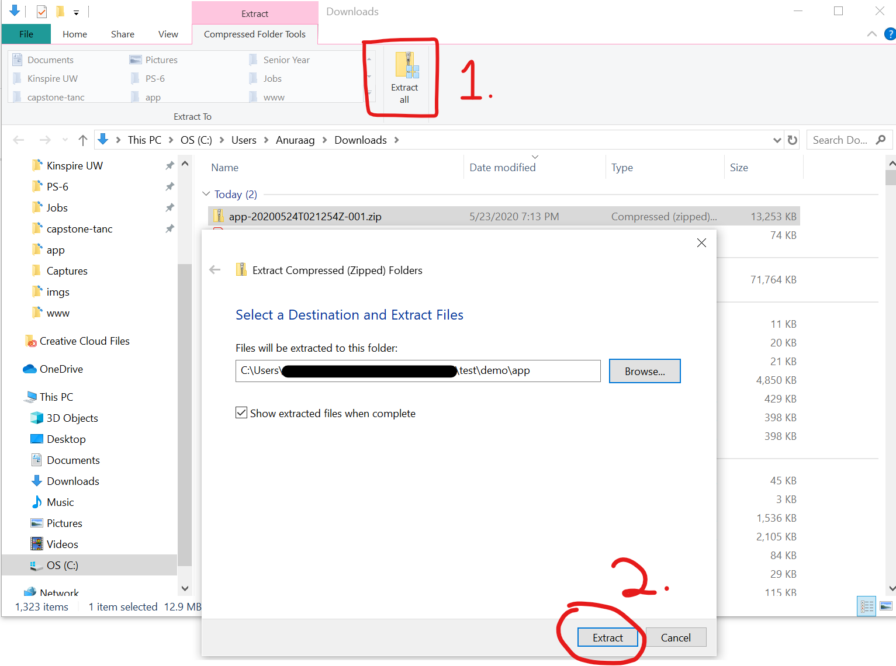
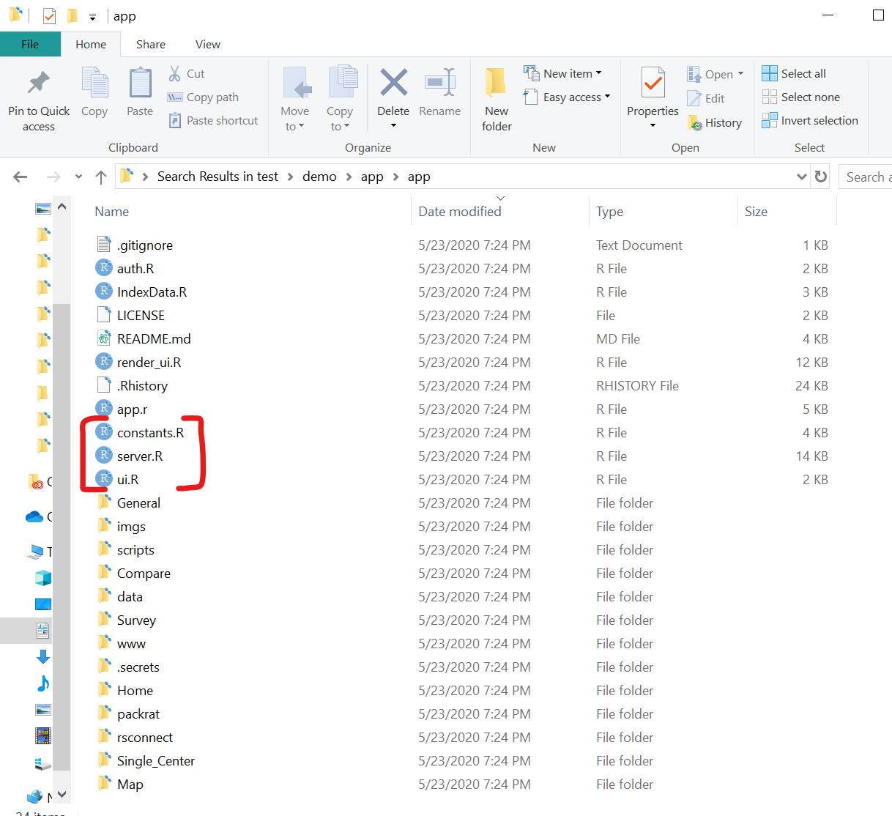
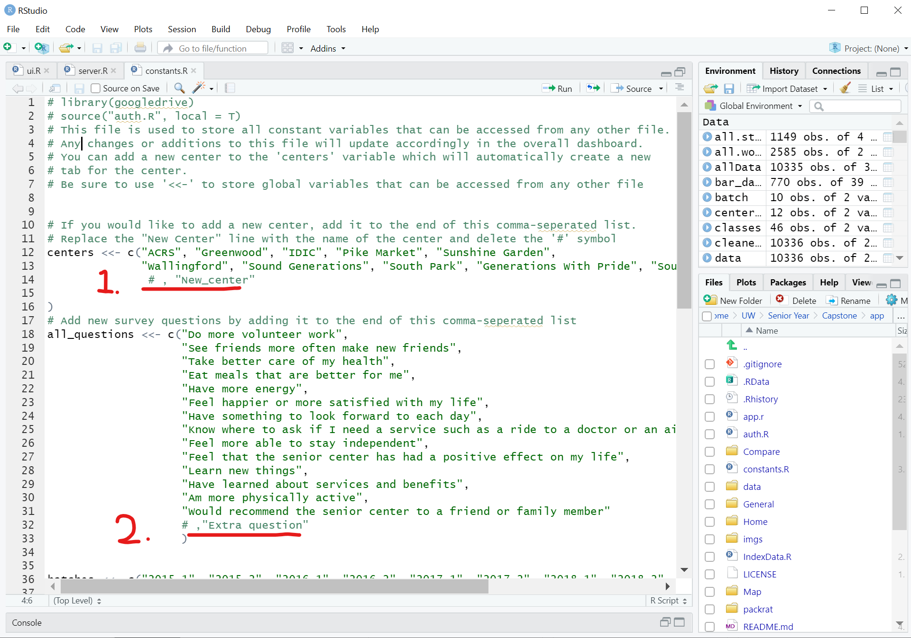
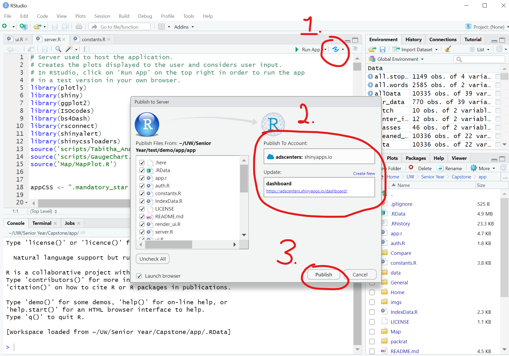

# ADS Dashboard app folder
This folder holds all the source code for creating the ADS Dashboard, which is published 
[here](https://adscenters.shinyapps.io/dashboard/)

## Structure
Each sub folder contains files that build different parts of the dashboard. 
* **Home** - home page that shows list of all senior center
* **Single_Center** - each senior centers "View Data" page
* **Compare** - Comparing Centers tab that analyzes differences between each center
* **Survey** - Creates the tab for survey questions and also files for storing the responses in Google Sheets 
* **Scripts** - Holds code for making graphs and data visualizations
* **www** - holds files for when publishing the app to a web page, including pictures, CSS style sheets, and documentation
* **data** - holds all the data we have from previous survey responses, senior centers, and demographics

The files **server.R** and **ui.R** contains the code for compiling all these source files into a single app and builds the actual user interface (ui) and handles the backend data calculations (server).

## Using the app
Watch these videos to understand how to use the dashboard and access the survey responses in the Google drive.
* Using the dashboard [Tabitha your video goes here]
* Submitting a survey and viewing the results: [Survey walk-through](https://youtu.be/3fNGA_zPH_Q)

# How to make changes
> Carlos if you're reading this, it's probably for you

If you would like to download the source code and make changes such as adding or changing senior centers, follow these step-by-step instructions.

## First, download the necessary code editing programs
The entire app is written using a coding language called _R_. If you decide to add or remove any Senior Centers, you will need to download R _AND_ RStudio (a coding editor) and modify the code. 
* Download R for Windows [here](https://cran.r-project.org/bin/windows/base/) *OR* R for MacOS [here](https://cran.r-project.org/bin/macosx/).

* Download Rstudio [here](https://rstudio.com/products/rstudio/download/) and download the free version. This is what you can use to easily open up R files.

## Second, download the app files
To get the R files on to your computer, you have two options: 
1. __Cloning the repository from Github__: This requires more technical skills such as using Git and the command terminal, but if you would like to do it, here is a good step-by-step process of how to get this loaded to your desktop:

> * https://help.github.com/en/desktop/contributing-to-projects/cloning-a-repository-from-github-to-github-desktop

2. __Downloading the files directly from Google Drive__: This method is simple and doesn't require much technical skills to download. Follow the step-by-step guide below 

### Log into Google Drive 
Log in with adscenterdata@gmail.com and navigate to My Drive. Find the 'app' folder and right click on it to download as a zip file.

### Unzip files
From the 'Extract' menu on the top click on 'Extract all' (1) and choose the location for the contents of the zip file to be saved in. Click on 'Extract' (2). 

## Adding/changing information
Once extracted, you should be able to open the folder and see all the source code for the dashboard.
The only files you need are are **constants.R**, **server.R**, and **ui.R**. Right-click and say "Open With" Rstudio. 

### Small Changes (Minimal Coding Experience)
If you would like to change or update any information, such as adding a new senior center, adding new survey questions, or changing the income brackets, you need to edit the **constants.R** file. Open this file in RStudio or a similar code editor and see instructions within the file as to how to make these changes. 

### Change constants
You should see the following workspace:

If you would like to add a senior center, look at (1) and delete the '#' symbol. Change the words 'New_center' with whatever center you would like to add. 

Follow along with my video of making a change to a center here: https://www.youtube.com/watch?v=oCdbAPjAEz8

### Bigger Changes (More coding experience needed)
If you would like to change more specific elements such as the layout of UI elements, please contact one of the developers before proceeding. If you feel that you have enough knowledge of R or CSS, you can make changes in the **style.css** file in the "*www*" folder.

## Republishing the App
When a change is made in the **constants.R** file, the page will need to be re-deployed before the changes will be reflected. To do this you _must_ open the either the **server.R** or **ui.R** in RStudio. Here are the steps needed to re-publish the application.

Follow along this online video for a tutorial to help with the deployment process: https://www.youtube.com/watch?v=ZKWLfW4zBYs

or use this video for how to publish this app specifically to the ADS Dashboard: https://youtu.be/oCdbAPjAEz8?t=59

### Publish

1. In the top right corner of these files, there should be a round bluish icon (figure 1). When you click on the arrow to its right, click the Publish Application button. 
2. It will then prompt you to install the required packages needed to publish. Click Yes.
3. Next a Publish to Server pop up will appear. Here you will click the Add New Account link in the top right part of the screen.
4. Pick the ShinyApps.io
5. Now we must get the secret key to plug into the text box. Here you can follow the steps below, or try the already generated key 

  
here: 

    (rsconnect::setAccountInfo(name='adscenters',
			  token='7557947F76FE11F9A4ED09991C85B528',
			  secret='4am+/2rBfNN1r/pXDgHAjsEsGTn0eUCA9M5NPkv9'))

    + Log into shinyapps.io
    + Login: adscenterdata@gmail.com
    + 
 
        
Password:

            A1: Kingcounty1 
        

    + Click the accounts image icon in the top right corner and select Tokens
    + Click the Show button and then the Show Secret button
    + Copy and paste the _entire_ rsconnect function into the text box given on the RStudio and click Connect Account
    + Click on the newly added account and press publish.
  

